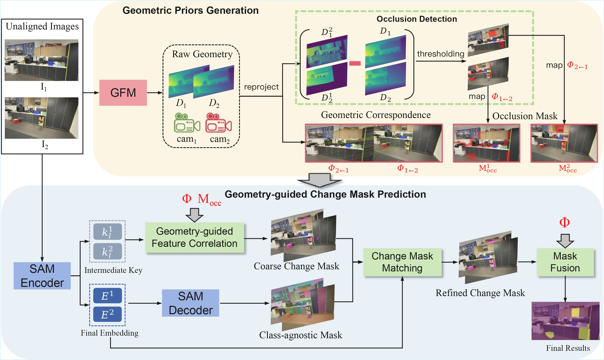

<div align="center">

# Leveraging Geometric Priors for Unaligned Scene Change Detection

[](https://arxiv.org/abs/2509.11292)
<!-- []()
[]()
[]() -->

<br>

Ziling Liu\*, Ziwei Chen\*, Mingqi Gao, Jinyu Yang, Feng Zheng  
<!-- Southern University of Science and Technology   -->

\*Equal contribution

</div>


# Overview

This repository provides the official implementation of: **Leveraging Geometric Priors for Unaligned Scene Change Detection**.

We propose a **training-free scene change detection framework** that leverages geometric priors and foundation models to detect scene changes from **unaligned image pairs**.

<div align="center">
  
  <br>
  <b>Our Method</b>
</div>


# Installation

## Step 1: Create Conda Environment

```bash
conda create -n geoscd python=3.10
conda activate geoscd
```


## Step 2: Install PyTorch

We use CUDA 11.8:

```bash
pip install torch==2.6.0 torchvision==0.21.0 torchaudio==2.6.0 \
--index-url https://download.pytorch.org/whl/cu118
```


## Step 3: Install Dependencies

```bash
pip install -r requirements.txt
pip install git+https://github.com/facebookresearch/segment-anything.git
```

# Download Models and processed datasets 

Please download the required foundation models and place them under:

```
src/pretrained/
```

## Model

| Model | Download Link | Target Path |
|------|---------------|------------|
| SAM ViT-H | https://github.com/facebookresearch/segment-anything | `src/pretrained/sam_vit_h.pth` |
| VGGT-1B | https://huggingface.co/facebook/VGGT-1B/blob/main/model.pt | `src/pretrained/model.pt` |

## Datasets
Download from Google Drive: https://drive.google.com/drive/folders/16Z_7EWp--psRxRtgq-SZcoUMOCK8ASuY?usp=drive_link

Example directory structure:

```
data/
 ├── changesim/
 │── PSCD/
 │── PASLCD/
src/
 ├── pretrained/
 │    ├── sam_vit_h.pth
 │    └── model.pt
```


# Inference

## Multi-GPU Inference

```bash
cd src

bash scripts/changesim_multi_gpu.sh
bash scripts/paslcd_multi_gpu.sh
bash scripts/pscd_multi_gpu.sh
```

---

## Single GPU Inference

```bash
cd src

bash scripts/changesim_single_gpu.sh
bash scripts/paslcd_single_gpu.sh
bash scripts/pscd_single_gpu.sh
```

---

# Evaluation

## ChangeSim

```bash
python src/evaluations/eval_changesim.py \
--gt-root data/changesim \
--results-root results/changesim \
--output-csv metrics/changesim_summary.csv
```

---

## PSCD

```bash
python src/evaluations/eval_pscd.py \
--gt-root data/PSCD/mask \
--results-root results/pscd \
--output-csv metrics/pscd_summary.csv
```

---

## PASLCD

```bash
python src/evaluations/eval_paslcd.py \
--gt-root data/PASLCD \
--results-root results/paslcd \
--output-csv metrics/paslcd_summary.csv
```


<!-- ---

# TODO

- [x] Release inference code  
- [x] Release evaluation code  
- [ ] Release project page  
- [ ] Release pretrained weights  
- [ ] Release visualization examples   -->


---

# Acknowledgement

This project builds upon several excellent open-source works:

- [GeSCF](https://github.com/1124jaewookim/towards-generalizable-scene-change-detection) build robust zero shot SCD upon [SAM](https://github.com/facebookresearch/segment-anything).
 

- [VGGT](https://github.com/facebookresearch/vggt) provide strong geometric prediction which we use to build robust pixel correspondence and detect occlusion.

- [RSCD](https://github.com/ChadLin9596/Robust-Scene-Change-Detection) provide the trianing framework and data augmentation strategy which we apply to other training based method to explore their ability under unaligned settings.   

We sincerely thank the authors for their contributions.

---

# Citation

If you find this work useful, please cite:

```bibtex
@article{liu2025leveraging,
  title={Leveraging Geometric Priors for Unaligned Scene Change Detection},
  author={Liu, Ziling and Chen, Ziwei and Gao, Mingqi and Yang, Jinyu and Zheng, Feng},
  journal={arXiv preprint arXiv:2509.11292},
  year={2025}
}
```
# License

This project is licensed under the MIT License - see the [LICENSE](LICENSE) file for details.

